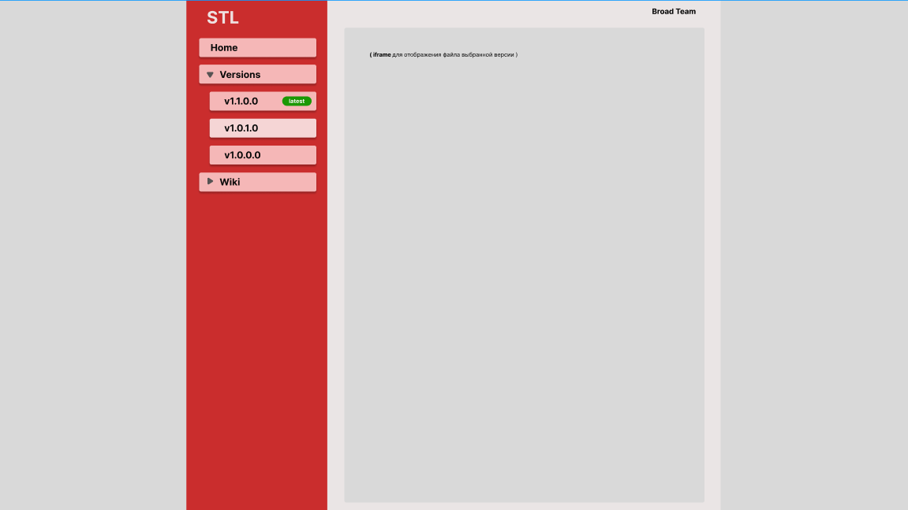

# Change html generation

Необходимо изменить верстку документации для проектов.
Идея заключается в том, что для каждой задачи по проекту присваивается уникальный номер от 1. Для каждой задачи создаются два markdown файла:

- `.docs/tasks/1.md` - Описание задачи - что требуется сделать.
- `.docs/features/1.md` - Описание проделанных работ и добавленного функционала в рамках задачи.

В файле `.docs/tasks.md` несколько задач группируются в одну версию `v3.9.2.0`.

После того, как все работы над выпуском новой версии завершены, вызывается powershell скрипт, который производит сборку всех проектов и генерирует документацию на основе `.docs/features/` файлов. На выходе мы получаем новый файл документации в директории `.docs/versions/` и после этого создается `HTML` версия документации в директории `.docs/versions_html/`.

Файлы проектов и документации создаются во временной директории `./.tmp/`. Так же создается файл `readme.html` В котором можно посмотреть историю по всем версиям проекта.

Основные задачи, что нужно будет сделать:

- [ ] 1. Изменить верстку главной страницы
- [ ] 2. Улучшить конвертирование markdown в html

Команда для запуска сборки проектов и автогенерации html документации из powershell:

```powershell
.\0004\.scripts\workflow_new_release.ps1 "v3.9.2.0"
```

## 1. Изменить верстку главной страницы

- [ ] Отцентровать контент по центру (ширина 1200px)
- [ ] Изменить левое меню. Добавить выпадающий список для версий
- [ ] Добавить новый пункт **Home**
- [ ] Добавить новый пункт выпадающего меню **Wiki**

## 2. Улучшить конвертирование markdown в html

Powershell скрипт конвертирует markdown в html путем определения md тегов. За ориентир стилей можно взять выходной pdf файл, который делает Obsidian.

- [ ] Изменить файл конвертирования markdown to html `./scripts/md_to_html_template.ps1` добавив html классы
- [ ] Добавить css стили `.scripts/doc/template_version.html` для лучшего отображения контента


