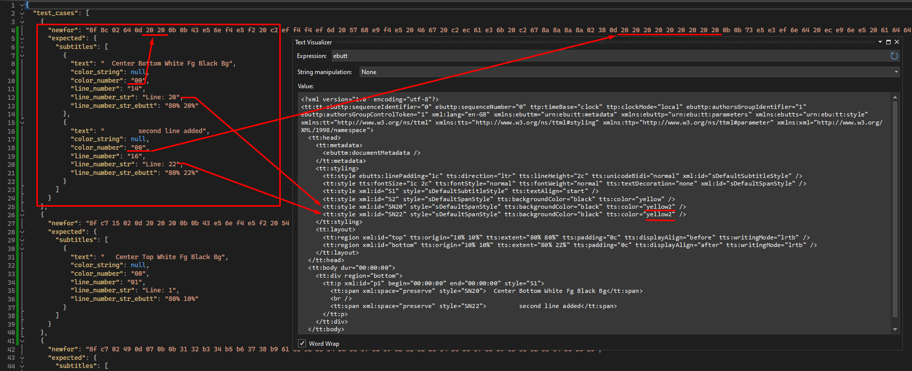

### Newfor parsing. Fix color detection

Fixed Newfor color detection. The color is searched after 2 bytes responsible for the line number.

For EBU-TT subtitle generation, if the color is not specified in Newfor, the default color `white` is used. Previously used `yellow2`
