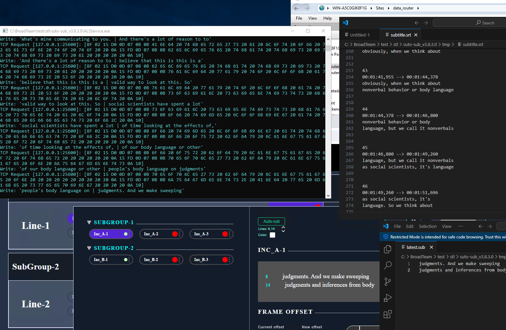

### #autosub Add the ability to combine multiple modes "subtitle_write_mode"

Changed `subtitle_write_mode` settings in file `ApplicationSettings.json` from single value to array

Example:

```
{
  "grpc_service_ip": "127.0.0.1",
  "grpc_service_port": 9740,
  "subtitles_timeout_ms": 2000,
  "subtitle_lines": "8,14",
  "subtitle_start_mode": 1,
  "subtitle_write_mode": [ 0, 1, 2 ], // <--- Changed to Array
  "subtitle_srt_path": "./tmp/subtitle.srt",
  "subtitle_latest_path": "./tmp/latest.sub",
  "subtitle_gen_line_mode": 0
}
```

Now can be activated all modes 
- Send via TCP or UDP as Newfor
- Write to SRT file
- Write latest subtitle to a file as simple text

