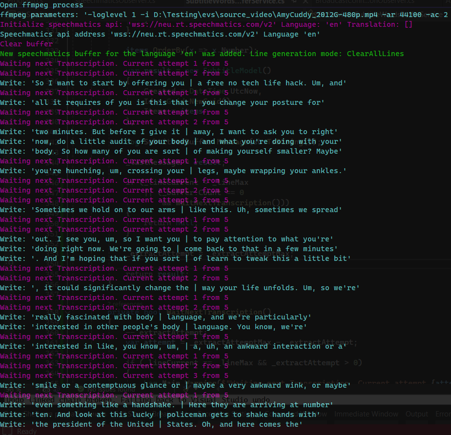

### #autosub Wait some iterations to fill subtitle lines if there are not fully completed

The problem is that when receiving a subtitle - the line may not be completely filled yet.

Thus, we get a duplicate subtitle.

For example:

```
- ...
- So I want to start by offering you | a free no tech life hack
- So I want to start by offering you | a free no tech life hack, and all
- ...
```

To avoid such a situation and not to lose the last subtitle when the transcription stops coming, we add a new parameter `subtitle_extract_attempts` to the settings file `ApplicationSettings.json`, which specifies the number of iterations that will wait for the Transcription to come in before giving an incompletely formed subtitle. One iteration is specified milliseconds in `subtitles_timeout_ms`.

