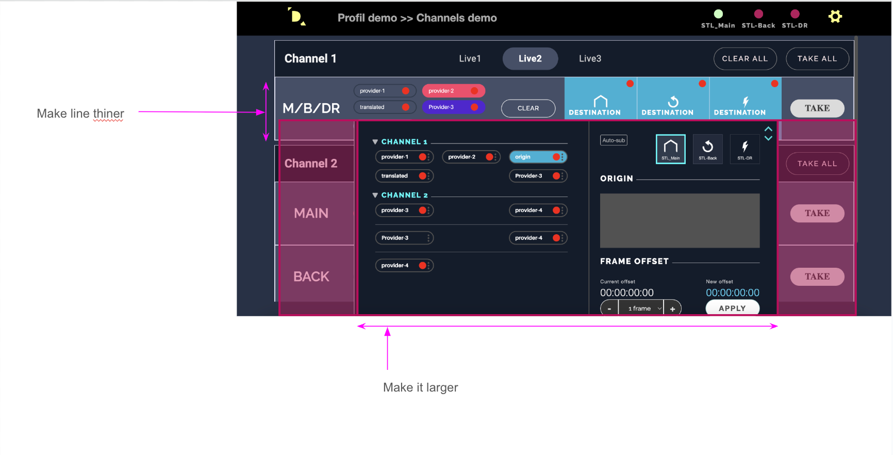
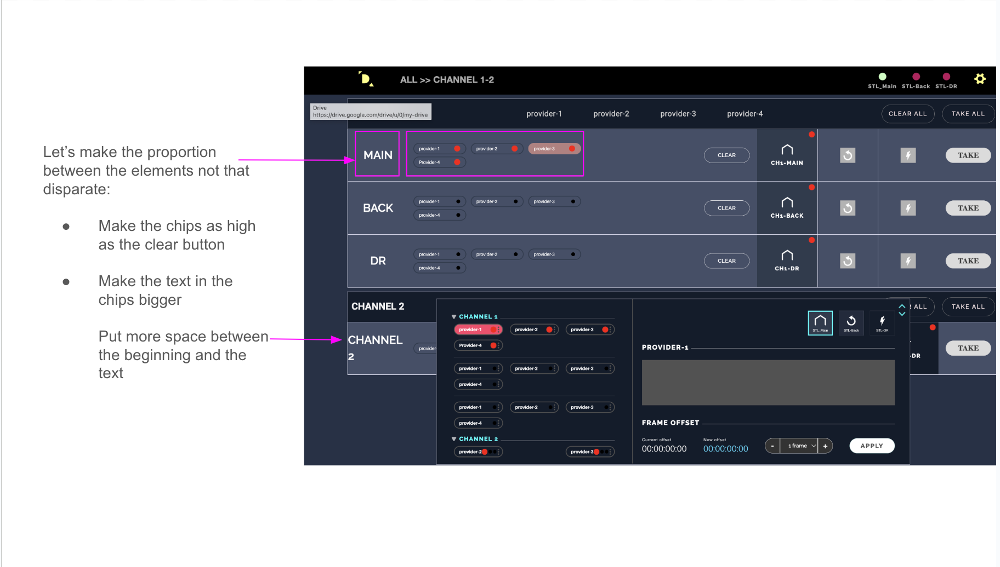
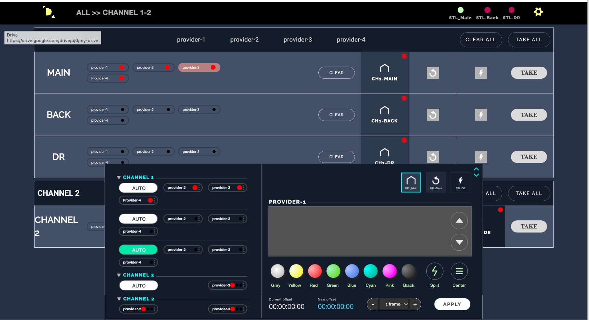

## #37 Manage line from datarouter for autosub

---

On Datarouter, we add two buttons &#39;Up&#39; and &#39;Down&#39;
Up sends a command to AutoSub to change lines 2 up (for instance from 16,18 to 14,16)
Down sends a command to change 2 lines down

 white, green, red, magenta, cyan, black
 
 Gray, yellow, red, green, blue, Cyan, Pink, Black