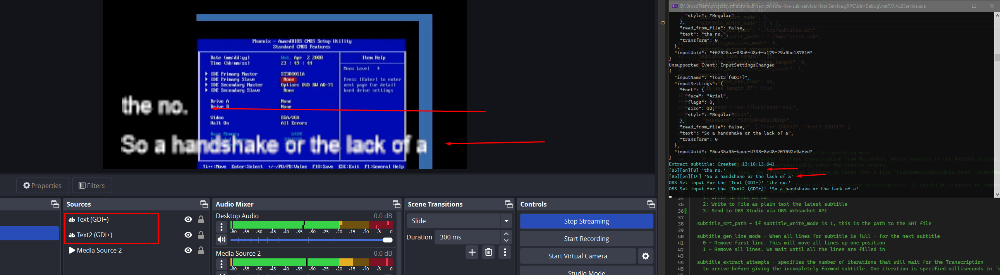

# stl version v3.8.7.0
Date: 2024.09.19

## Issues in Milestone

---

- #29 Implement OBS API and make new subtitle delivery type

## Features

---

### Implement OBS API and make new subtitle delivery type

#### 1. Changed `ApplicationSettings.json` file.

1. Added new mode `3` for the `subtitle_write_mode`

**subtitle_write_mode** - Choose what to do with the received transcriptions. It should be sequence of numbers separated by commas.

- 0: Send via TCP or UDP as Newfor
- 1: Write to file as SRT
- 2: Write to file as plain text the latest subtitle
- 3: Send to OBS Studio via OBS Websocket API

2. Added settings for OBS WebSocket API configuration

```
obs.address - OBS Studio WebSocket API Address
obs.login - OBS Studio WebSocket API Login
obs.password - OBS Studio WebSocket API Login
obs.subtitle_lines - List of text components to which subtitles will be added
```

Example:

```json
{
  "grpc_service_ip": "127.0.0.1",
  "grpc_service_port": 9740,
  "subtitles_timeout_ms": 2000,
  "subtitle_lines": "8,14",
  "subtitle_start_mode": 1,
  "subtitle_write_mode": [0, 1, 3],
  "subtitle_srt_path": "./tmp/subtitle.srt",
  "subtitle_latest_path": "./tmp/latest.sub",
  "subtitle_gen_line_mode": 0,
  "subtitle_extract_attempts": 0,
  "subtitle_line_length": 35,
  "subtitle_punctuation_line_length": 30,
  "subtitle_punctuation_line_start": 2,
  "newfor": {
    "max_bytes_for_line": 35,
    "is_use_length_37": true
  },
  "obs": {
    "address": "ws://localhost:4455",
    "login": "admin",
    "password": "SdYXAP4WCu1VDHg4",
    "subtitle_lines": ["Text (GDI+)", "Text2 (GDI+)"]
  }
}
```

#### 3. Added new module to send subtitle as simple text into OBS Studio via OBS WebSocket API

Used nuget `obs-websocket-dotnet` for communicate with the OBS Studio.

```
https://github.com/BarRaider/obs-websocket-dotnet
```

Connection to OBS Studio occurs at the moment of application startup and is checked during the application operation

If the `subtitle_write_mode` settings contain the `3` parameter and the connection to OBS is active, after the subtitle is built, the text from the subtitle will be sent to OBS Studio.

To do this, you need to specify the names of the text Source from OBS Studio in `subtitle_lines`





