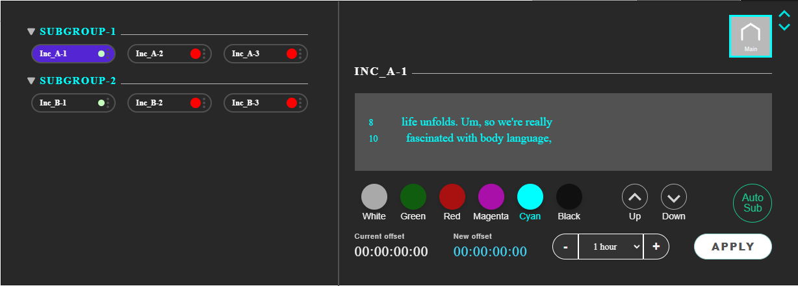
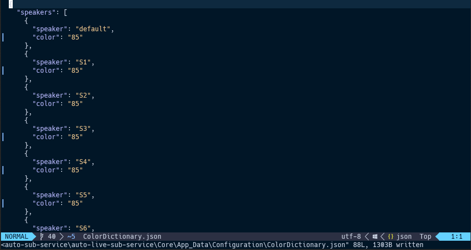
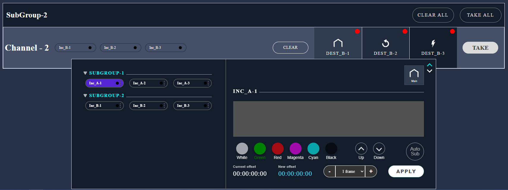
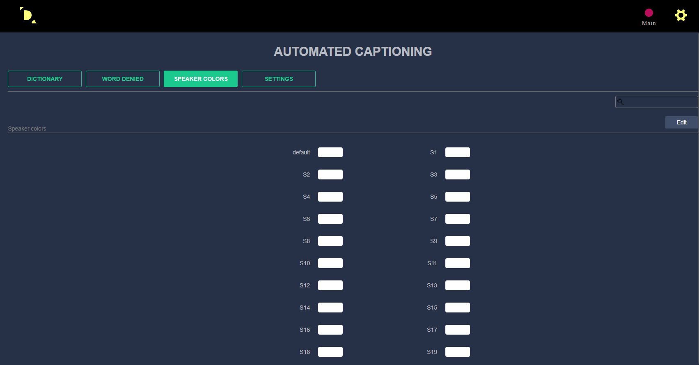
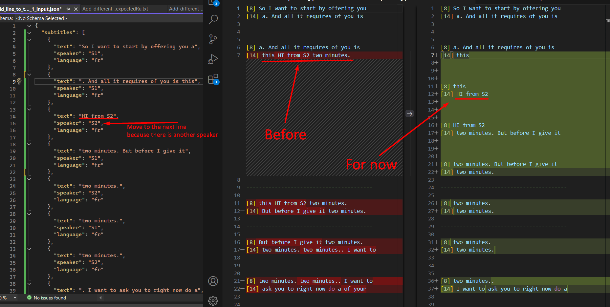
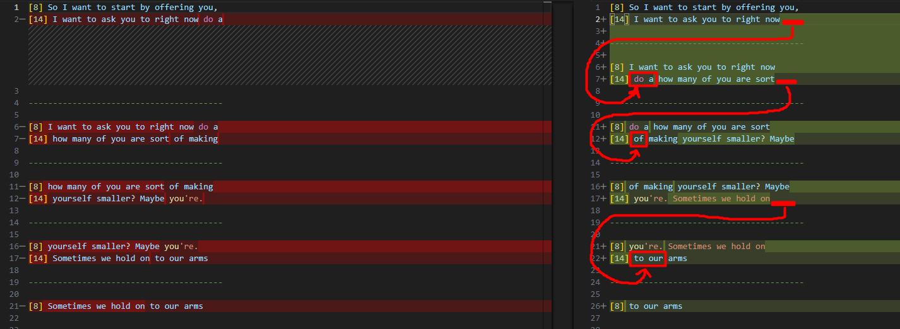
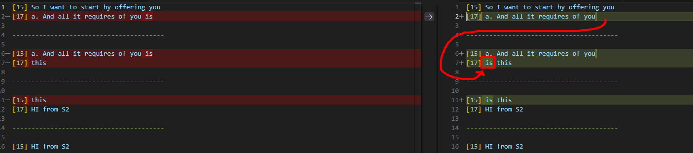
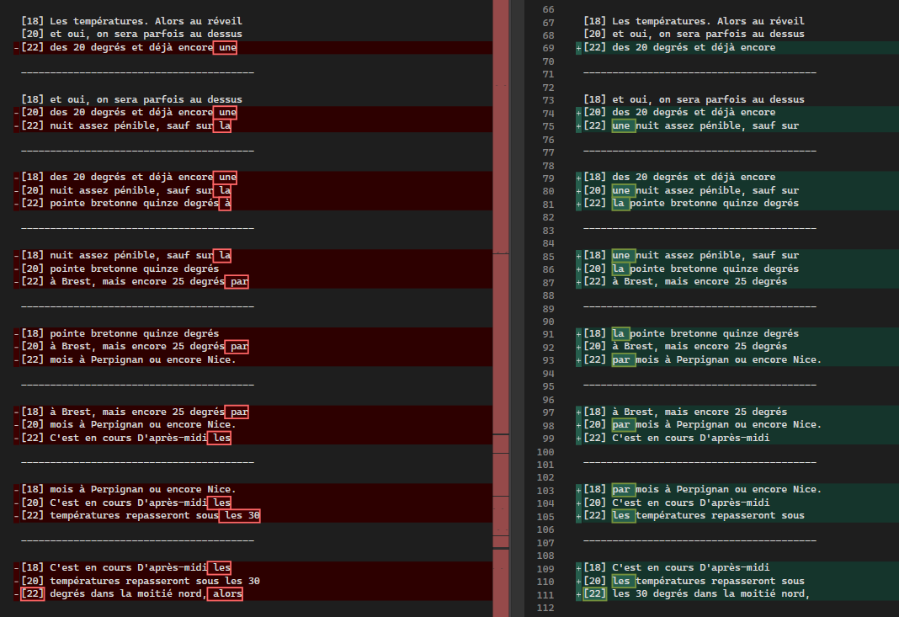

# stl version v3.8.9.0
Date: 2024.11.27

## Issues in Milestone

---

- #37 #datarouter Manage line from datarouter for autosub
- #40 #datarouter Manage the color dynamically in Datarouter and Autosub
- #44 #datarouter Remove all color management except for manual choice from Webpage
- #43 #autosub Set new line for new speaker
- #49 #autosub Change line completing mechanism to add check length of latest two words

## Features

---

### Manage line from datarouter for autosub

The design for working with the **AutoSub** color and line number parameters has been changed.



Added 6 buttons for selecting colors

1. White
2. Green
3. Red
4. Magenta
5. Cyan
6. Black

Two buttons for changing the line number. When changing lines up or down, only the first line number is taken into account. The shift occurs in increments of two lines.

The **Auto-Sub** button changes color to green when subtitles are actively broadcasting and to gray in standby mode. If the **Auto-Sub** option is unavailable, the "Offline" button in red is displayed instead of the **Auto-Sub** button.

### Manage the color dynamically in Datarouter and Autosub

When we change the color in **DataRouter** we change the color for all `AutoSub` `Speaker Color`.






### Datarouter. Remove all color management except for manual choice from Webpage

Before:



After:


### Autosub. Set new line for new speaker

If the transcription contains a new speaker - Move the word to a new line.




### #autosub Change line completing mechanism to add check length of latest two words

When a line completed, we look at the last two words.
We call them `N-1` and `N`:

```
if N  > 3, we do nothing.
If N <= 3, we look at N-1:
      if N-1  > 2 : we move N word to the next line
      if N-1 <= 2 : we move N-1 and N words to the next line
```






