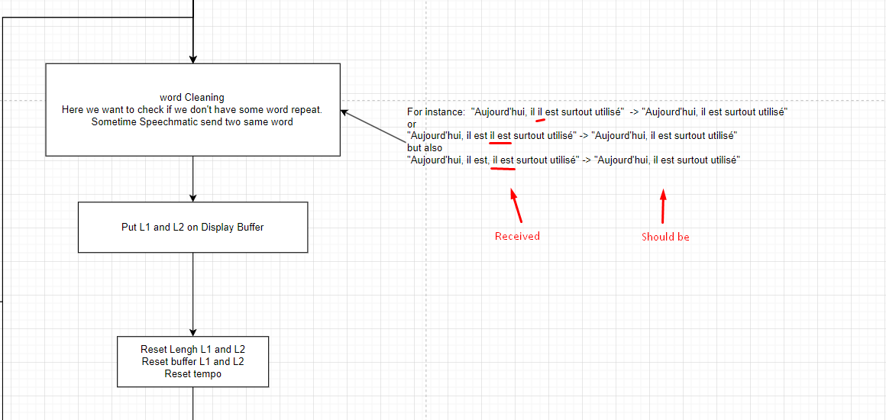

# Backlog grooming

---

**Date**: 2024.08.27 13:00

## Participants

---

- Andrey Shalashenko

## Projects

---

- subtitles converter

## Tasks

---

- [ ] Create a diagram of the architecture of duplicate the words
- [ ] Change sequence of convert transcription to subtitle
- [ ] Make filter to clear duplicates from transcription
- [ ] Move to the next line if added symbol is punctuation
- [ ] Change subtitle delivery process. Wait until the subtitle is fully filled

### Context

Sometime the human is repeating some word

## Discussion

Because actually we manage it as two words for example `Aujourd'hui, il est, il est surout`

1. `Aujourd'hui,`
2. `il`
3. `est,`
4. `il`
5. `est`
6. `surout`

So we will need to detect duplicates and remove them if there are no other words between them (punctuation marks are not taken into account)

We have 3 main processes

1. Receiving transcription from Speechmatics and filling the "word buffer"
2. Forming a subtitle based on the "word buffer". The process starts every X seconds. The timeout is specified in the settings. Formed subtitles are written to the "Subtitles buffer"
3. Sending subtitles. Every X seconds we get a subtitle, if there is one, and depending on the settings we can convert it to Newfor and send it via UDP/TCP, write it to a file as SRT, write it to a file as plain text

We can also have several buffers at the same time, depending on the language used.

### Questions

## Next backlog grooming

---

**Date**: 2024.08.28 16:00
**Goals**: Main goals for the next backlog grooming meeting
