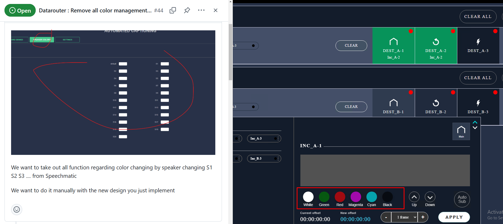

# Backlog grooming

---

**Date**: 2024.11.22

## Participants

---

- Andrey Shalashenko

## Projects

---

- #datarouter
- #autosub

### Context

About the [#44 Datarouter : Remove all color management except for manual choice from Webpage](https://github.com/BT-Company/stl/issues/44) issue

To be sure how it should works :)

We have 20 color for the 20 speakers in AutoSub and Default color if there is no speaker specified.

In autosub we keep these color settings in json file.
And when we click by color in DataRouter we should set color for the Speaker-1 as it works now.

Is it right?

About the #44 issue
To be sure how it should works :)

We have 20 color for the 20 speakers in AutoSub and Default color if there is no speaker specified

In autosub we keep these color settings in json file
And when we click by color in DataRouter we should set color for the Speaker-1 as it works now

Is it right?

Alain, 2:51 PM
no, we forget all about this. No more colour with Speaker

We manage colour only: 1 default colour when we start Autosub (in setting file)

And now, how the Speaker will work:

1. When we change the Speaker: the text must start on a new line (first step)

2. Later: it is about identification of a Speaker. When we start Autosub, the Speechmatics systems starts to count the Speakers. When we have a new Speaker, we will try to identify who is Speaking and we will use a name at the beginning of the new text. So, it will be in configuration:
   A list with:
   NAME | SHORT NAME | parameters for identification (Maël will give you that later)
   When we see S1 and we found in the list of identification: for the first time S1, we will create a Newfor line: "ALAIN BIED: it is how it works" (NAME) then next time S1 is coming again after a change, it will be "A. BIED: it has changed" (SHORT NAME)

We don't need to have S1, S2... because it will be dynamic

2; by changing manually with the panel
Alain Bied Broadteam, Today at 2:52 PM
and after changing, we keep this colour for all messages until we change again

Ok so

1. We have one color for the all speakers
2. When speaker changed - we should switch to the next line
3. When we receive some transcription we should get a speaker FullName and speaker ShortName from the Mael API.
   Mael's api receive speaker number like 'S1' and return (for example) {"ALAIN BIED","A. BIED"}
4. If the received transcription is the first transcription of the speaker, then use FullName, otherwise ShortName
5. The first line of each subtitle should start with the speaker name

Another point to add to Step 1: when you have a line completed, we look at the last two words, we call them N-1 and N:
if N>3, we do nothing.
If N<=3, we look at N-1:
if N-1>2 : we move N word to the next line
if N-1<=2: we move N-1 and N words to the next line

### Tasks

Step 1

- [ ] #datarouter Apply selected color for the all speakers
- [ ] #datarouter Remove page /Settings/AutoLiveSub/SpeakerColors
- [ ] #autosub Switch to the next line if there is new speaker in transcription
- [ ] #autosub Change line completing mechanism to add check length of latest two words

Step 2

- [ ] #autosub Getting speaker fullname from external api
- [ ] #autosub Display FullName if the received transcription is the first transcription of the speaker otherwise ShortName
- [ ] #autosub The first line of each subtitle should start with the speaker name

Step 3

- [ ] #datarouter STL file record management
- [ ] #stl STL Service licensing mechanism

### Questions

1.

## Next backlog grooming

---
