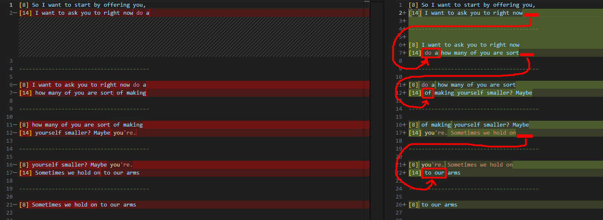
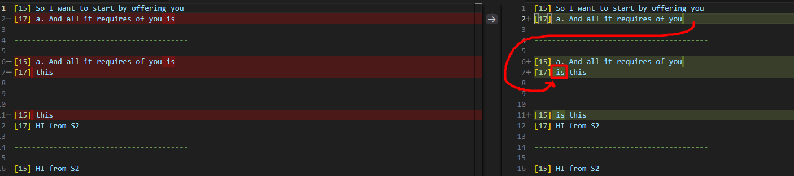

### #autosub Change line completing mechanism to add check length of latest two words

When a line completed, we look at the last two words.
We call them `N-1` and `N`:

```
if N  > 3, we do nothing.
If N <= 3, we look at N-1:
      if N-1  > 2 : we move N word to the next line
      if N-1 <= 2 : we move N-1 and N words to the next line
```




