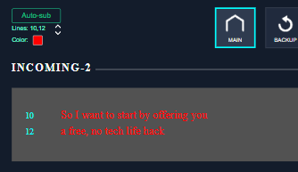
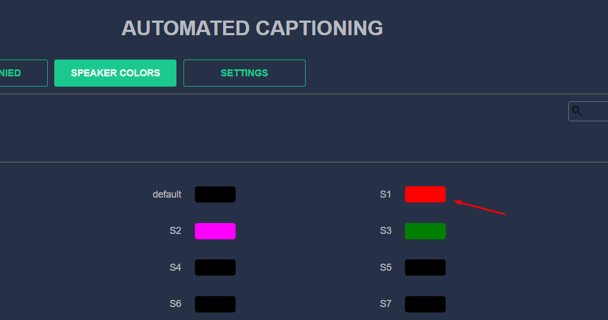

Task 7
Datarouter/STLService: we are testing now the automatic subtitling with Speechmatics. For now, we display on 3 lines: 18/20/22
1. I would like to change to two lines 20/22
2. We add two buttons in Datarouter to change this: Up-> it goes to 18/20 -> 16/18....(with limit to 2/4) Down-> it decreases (with limit to 20/22)
3. We add a button to change colour: by default, white. Then the colour White/Yellow/Red/Blue/Magenta/Cyan/Black.  It means that we need to add this in the newfor message 

---
## Subtitles Live Service (ALSService)

The calculation of lines for generating subtitles has been changed. Instead of using 3 lines by default, the number of lines is calculated based on those specified in the configuration file:
`ApplicationSettings.json`
```
 "subtitle_lines": "8,14"
```

## DataRouter. Changing Line Numbers for Subtitles Live Service


- Added display of line numbers from ALS Service settings. Added "Up" and "Down" buttons to the subtitles panel
- Minimum value - 2
- Maximum value - 22
- When you click on the "Down" button, the minimum line increases by +2. All subsequent lines are recalculated taking into account +2 from the original line
- When you click on the "Up" button, the minimum line is reduced by 2. All subsequent lines are recalculated taking into account +2 from the original line
Example:
1. Current value is "4, 20"
2. Click on the "Down" button
3. New value "6, 8"

## DataRouter. Changing subtitle color for Subtitles Live Service

A button has been added to the subtitle panel interface to change the color of Auto-Sub subtitles for speaker "S1".



When you click on the color change button, the following color is set from the list:
```
White/Yellow/Red/Blue/Magenta/Cyan/Black
```

## DataRouter. If the AutoSub service is not available, the "Offline" label is displayed

