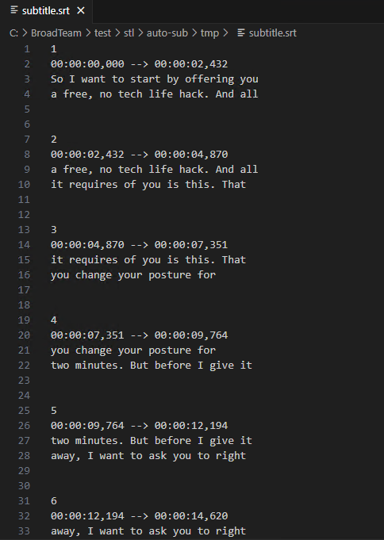

# stl version v3.8.0.0
Date: 2024.07.24

## Issues in Milestone
---
- [12] #autosub Make a settings to choose between send to TCP/UDP and write into file

## Features
---
### #autosub Make a settings to choose between send to TCP/UDP and write into file

Changed ApplicationSettings.json file. Added settings `subtitle_write_mode` and `subtitle_srt_path`:

```
subtitle_write_mode - Choose what to do with the received transcriptions
    0: Send via TCP or UDP as Newfor
    1: Write to file as SRT

subtitle_srt_path - if subtitle_write_mode is 1, this is the path to the SRT file
```

Если `subtitle_write_mode = 1` мы записываем полученные transcriptions в файл указанный в `subtitle_srt_path`.

In this case, to determine the subtitle time, we use the following scheme:
When we receive the first subtitle, we do not write it to a file, but wait for the next one.
When we get the next subtitle, we subtract the creation time of both subtitles and get the duration of the previous subtitle.
This way we can fill the time value in SRT.
But with this approach, we may not record the last transcription received.

