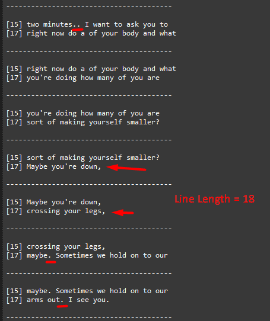

# stl version v3.8.8.0
Date: 2024.09.19

## Issues in Milestone

---

- #33 Subtitle building rework. Changing the punctuation behavior

## Features

---

### Subtitle building rework. Changing the punctuation behavior

#### 1. Fixed the situation when the subtitle started from the second line. Now all subtitles start from the first line.

#### 2. After completing attempts to `subtitle_extract_attempts` to get a subtitle from the buffer, provided that there are no new incoming transcriptions and there are no words in the buffer, an empty subtitle is sent.

Example:

```
----------------------------------------

[8] yourself smaller? Maybe you're.
[14] Sometimes we hold on to our arms

----------------------------------------

[8] Sometimes we hold on to our arms

----------------------------------------

[8]
[14]

----------------------------------------
```

#### 3. Added new parameters to `ApplicationSettings.json`

   1. **subtitle_punctuation_line_length** - Position in the line after which words after a punctuation mark will be wrapped to a new line
   2. **subtitle_punctuation_line_start** - Line number from which to start wrapping words after a punctuation mark to a new line```

Full Settings:

```json
{
  "grpc_service_ip": "127.0.0.1",
  "grpc_service_port": 9740,
  "subtitles_timeout_ms": 2000,
  "subtitle_lines": "8,14",
  "subtitle_start_mode": 1,
  "subtitle_write_mode": [0],
  "subtitle_srt_path": "./tmp/subtitle.srt",
  "subtitle_latest_path": "./tmp/latest.sub",
  "subtitle_gen_line_mode": 0,
  "subtitle_extract_attempts": 0,
  "subtitle_line_length": 35,
  "subtitle_punctuation_line_length": 30,
  "subtitle_punctuation_line_start": 2,
  "newfor": {
    "max_bytes_for_line": 35,
    "is_use_length_37": true
  }
}
```

#### 4. The process of wrapping text to the next line when a punctuation mark is encountered has been changed

The `,` symbol has been added, after which the wrapping to the next line will also be performed.

The symbols after which the wrapping to the next line will be performed: `. , ! ? ;`

Two conditions have been added for wrapping text to the next line after a punctuation mark

    1. The punctuation mark must be at a position in the line greater than or equal to the value specified in `subtitle_line_punctuation_length`
    2. The current line must be greater than or equal to the value specified in `subtitle_punctuation_line_start`. Line numbering starts from 1. The line number for Newfor is specified in the `subtitle_lines` value.




